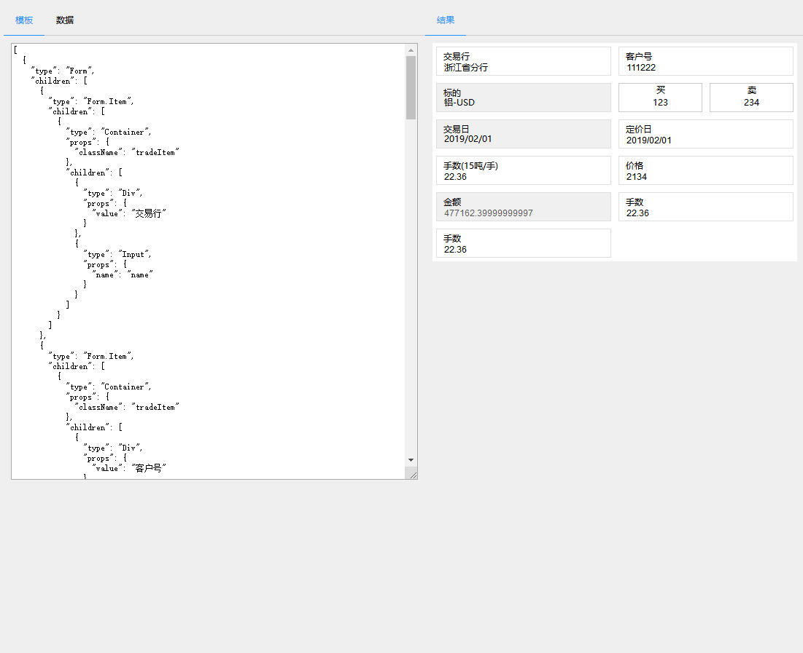

# dynamic-page
动态页面，使用react组件进行动态拼装页面,生成对应的模板json数据。
***
创建组件的方式
## npm安装

```bash
npm install dynamic-page --save
```
# 基本使用方式
```js
<Dynamic enableRedux={true} reducers={reducers} components={all} childTpl={childTpl} className="tradeBox" tpl={this.state.tpl} data={this.state.data}></Dynamic>
```
## 效果图

## 模板配置说明
[详细模板说明](config.md)
## 模板形式如下
```
 [{
    "type": "Form",
    "children": [
      {
        "type": "Form.Item",
        "children": [{
          "type": "Container",
          "props": {
            "className": "tradeItem"
          },
          "children": [{
            "type": "Div",
            "props": {
              "value": "交易行"
            }
          }, {
            "type": "Input",
            "props": {
              "name": "name"
            }
          }]
        }]
      },
      {
        "type": "Form.Item",
        "children": [
          {
            "type": "Container",
            "props": {
              "className": "tradeItem"
            },
            "children": [{
              "type": "Div",
              "props": {
                "value": "客户号"
              }
            }, {
              "type": "InterInput",
              "props": {
                "name": "corp"
              }
            }]
          }]
      }, 
      {
        "type": "Form.Item",
        "children": [
          {
            "type": "Container",
            "props": {
              "className": "tradeItem"
            },
            "children": [{
              "type": "Div",
              "props": {
                "value": "标的"
              }
            }, {
              "type": "Div",
              "props": {
                "name": "underly",
                "className":"labelValue"
              }
            }]
          }]
      },
      {
        "type": "Form.Item",
        "children": [
          {
            "type": "RadioList",
            "props": {
              "className": "tradeItem"
            },
            "children": [{
              "type": "RadioList.Radio",
              "props": {
                "text": "买",
                "name":"bid"
              }
            }, {
              "type": "RadioList.Radio",
              "props": {
                "text": "卖",
                "name":"ask"
              }
            }]
          }]
      },
      {
        "type": "Form.Item",
        "children": [
          {
            "type": "Container",
            "props": {
              "className": "tradeItem"
            },
            "children": [{
              "type": "Div",
              "props": {
                "value": "交易日"
              }
            }, {
              "type": "Div",
              "props": {
                "name": "tradeDate",
                "className":"labelValue"
              }
            }]
          }]
      },
      {
        "type": "Form.Item",
        "children": [
          {
            "type": "Container",
            "props": {
              "className": "tradeItem"
            },
            "children": [{
              "type": "Div",
              "props": {
                "value": "定价日"
              }
            }, {
              "type": "Input",
              "props": {
                "name": "tradeDate"
              }
            }]
          }]
      },
      {
        "type": "Form.Item",
        "children": [
          {
            "type": "Container",
            "props": {
              "className": "tradeItem"
            },
            "children": [{
              "type": "Div",
              "props": {
                "value": "手数(15吨/手)"
              }
            }, {
              "type": "NumericInput",
              "props": {
                "name": "num",
                "decimals":"2"
              }
            }]
          }]
      },
      {
        "type": "Form.Item",
        "children": [
          {
            "type": "Container",
            "props": {
              "className": "tradeItem"
            },
            "children": [{
              "type": "Div",
              "props": {
                "value": "价格"
              }
            }, {
              "type": "ThousandInput",
              "props": {
                "name": "price",
                "decimals":"2"
              }
            }]
          }]
      },
      {
        "type": "Form.Item",
        "children": [
          {
            "type": "Container",
            "props": {
              "className": "tradeItem"
            },
            "children": [{
              "type": "Div",
              "props": {
                "value": "金额"
              }
            }, {
              "type": "ThousandInput",
              "props": {
                "name": "amount",
                "decimals":"2",
                "disabled":true
              }
            }]
          }]
      }, {
        "type": "Form.Item",
        "children": [
          {
            "type": "NumericItem",
            "props": {
              "label":"手数",
              "className": "tradeItem",
              "name": "num",
              "decimals": "2"
            },
          }]
      },{
        "type": "Form.Item",
        "children": [
          {
            "type": "HandNumItem",
            "isRedux":true,
            "props": {
              "label":"手数",
              "className": "tradeItem",
              "name": "num",
              "decimals": "2"
            },
          }]
      },
    ]
  }];
```
跨组件的交互，需要打开外层的`enableRedux`开关，内部使用`redux`实现，同时需要传入`reducers`，在要使用的组件上配置`enableRedux`开关,即可在当前组件的`props`上新增`update`方法。
```
this.props.update( data,'UPDATEHAND')
```
这里省略掉了`action`，`data`对应`reducer`的`action`,第二是`action.type`
# Api
## enableRedux
    打开redux，bool值，如果要跨组件的访问全局数据，需要设为true
## childTpl
    针对模板的继承操作，在tpl的基础上新增了四种操作类型
    [{
        action: "preinsert",
        id: 1,
        item: {
            "type": "TextItem",
            "props": {
                "className": "tradeItem",
                "label": "债券代码",
                "name":"num",
                "textcls":"labelValue"
            },
            "formatter":"thousand"
        },
    }]
## locale
    国际化语言
## checkPermission（powerBit）
    判断权限的方法，该方法接受一个权限位作为参数的钩子.权限位配置在组件的props.powerBit上.
## 新增全局配置options
    Dynamic.options={
      formatter:Formatter ,
      locale:zh_CN
    }
# 组件
  这里推荐使用`react-xui`里的组件，但理论上支持所有组件的，但如果你使用了`form`表单，建议你的表单组件中是使用的约束组件，并且提供`onChange`事件，`data`会自动绑定对应的`name`值的`value`属性
# 特殊组件
## BatchUpdate
  主要是做批量更新使用，props上暴露subscripe方法，参数为callback更新

    {
      "type": "BatchUpdate",
      "isRedux": true,
      props:{
        updateFields:{"num":"ask"},//更新data字段映射关系
        subscribe:function(callback){
            setInterval(()=>{
              callback({ask:Math.random()})
            },2000)
        }
      }
    }
### 关于作者
[https://github.com/tianxiangbing](https://github.com/tianxiangbing)

### xui
react xui组件一直在持续更新中，欢迎大家关注[https://github.com/react-xui](https://github.com/react-xui)